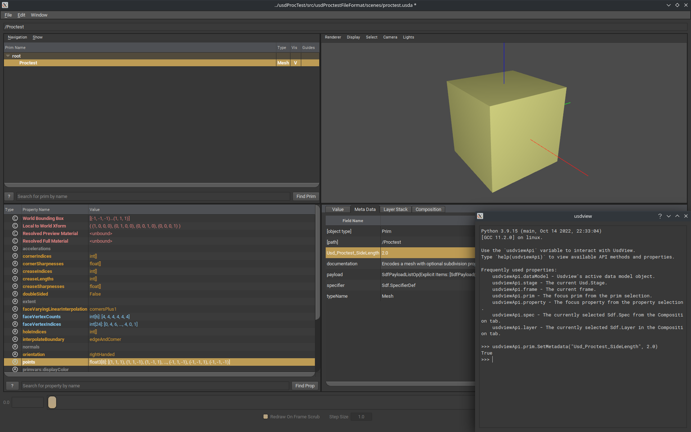

# usdProcTest - Tests around USD proceduralism

This repo contains a [USD](https://openusd.org) [file format plugin](https://graphics.pixar.com/usd/release/api/sdf_page_front.html#sdf_fileFormatPlugin) that proceduraly generates a cube centered on the origin. The metadata `Usd_Proctest_SideLength` is used to interactively set the length of the cube side.



## Build

### Requirements

- [CMake](https://cmake.org/)
- A [USD distribution](https://developer.nvidia.com/usd#bin)

### Build options

- `PXR_CONFIG_CMAKE`: location of the `pxrConfig.cmake` exported symbols (usually located at the root of the USD distribution folder).

### Build commands

```
# Generate the build files

cmake ../usdProctest -DCMAKE_INSTALL_PREFIX=$USD_ROOT/plugin/usd -DPXR_CONFIG_CMAKE=$USD_ROOT/pxrConfig.cmake

# Build and install

cmake --build . --target install

# Installed files:

# $USD_ROOT/plugin/usd
# ├── usdProctestFileFormat
# │   └── resources
# │       └── plugInfo.json
# └── usdProctestFileFormat.so
```

## Running

Add the path to the installed `pluginInfo.json` to the environment variable `PXR_PLUGINPATH_NAME` then run `usdview src/usdProctestFileFormat/scenes/proctest.usda`. If everything is setup correctly a cube should be shown.

## Acknowledgment

- Inspired from [Weta's USDPluginExamples](https://github.com/wetadigital/USDPluginExamples)
